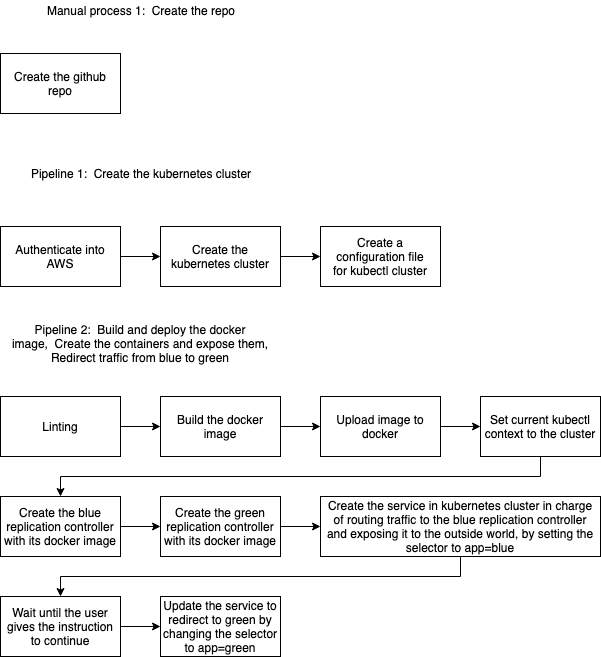

# capstone-nd9991
Capstone Project: To build a CI/CD pipeline for a microservices application for different deployment strategies.

## Installation

Jenkins Installation :

```bash
sudo apt-get update
sudo apt install -y default-jdk
wget -q -O - https://pkg.jenkins.io/debian/jenkins.io.key | sudo apt-key add -
sudo sh -c 'echo deb https://pkg.jenkins.io/debian-stable binary/ > /etc/apt/sources.list.d/jenkins.list'
sudo apt-get update
sudo apt-get install -y jenkins
```
# Project Overview
In this project I applied the skills and knowledge which were developed throughout the Cloud DevOps Nanodegree program. These include:
* Working in AWS
* Using Jenkins to implement Continuous Integration and Continuous Deployment
* Building pipelines
* Working with Ansible and CloudFormation to deploy clusters
* Building Kubernetes clusters
* Building Docker containers in pipelines

Under this project I develop a CI/CD pipeline for micro services applications with either blue/green deployment or rolling deployment. I also develop our Continuous Integration steps, which include typographical checking (aka “linting”).

Once I completed our Continuous Integration I set up Continuous Deployment, which include:

* Pushing the built Docker container(s) to the Docker repository (I use AWS EKS);
* Deploying these Docker container(s) to a small Kubernetes cluster. I build our own Kubernetes cluster. To deploy our Kubernetes cluster, I use within Jenkins as an independent pipeline.

I followed this [steps]('https://medium.com/@andresaaap/capstone-cloud-devops-nanodegree-4493ab439d48') to make my pipeline


# Steps In Completing the Project

* Step 1 : Propose and Scope the Project
* Step 2 : Use Jenkins, and implement blue/green or rolling deployment.
* Step 3 : Pick AWS Kubernetes as a Service, or build your own Kubernetes cluster
* Step 4 : Build your pipeline
* Step 5 : Test your pipeline